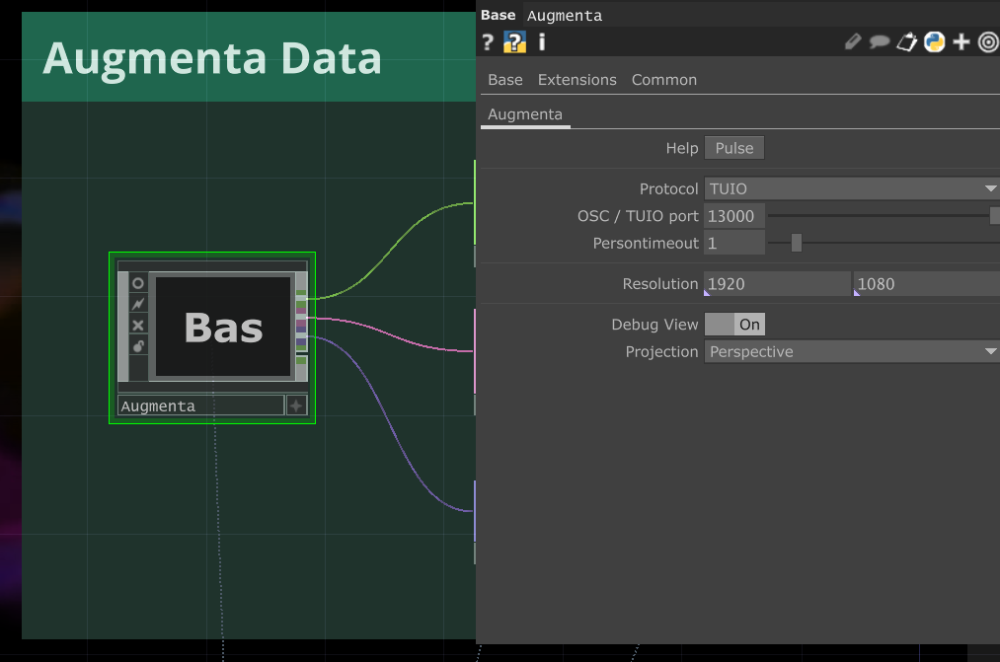

# Traces-collectives
Ce projet a été réalisé en 3 jours lors du workshop Erasme sur le thème de la mémoire par `Letchoumy THIAGARADJA` et `Thaï LAI`.

https://github.com/user-attachments/assets/fe0e2f7e-76fb-4de6-a634-dec73b167043

## Les prérequis

1. Un ordinateur avec au moins une carte graphique.
2. Un vidéo projecteur (préférablement courte focale).
3. Configurer AugmentaFusion en contactant leur équipe sur [leur site web](https://augmenta.tech/contact/) ou sur [Discord](https://discord.com/invite/ErWESYXR9x).
4. Télécharger le logiciel [TouchDesigner](https://derivative.ca/download).

## Description 

### Le but 

Ce projet parle de la `mémoire collective` et de son lien avec la mémoire individuelle. Le but est que l’utilisateur puisse laisser une trainée derrière lui.Chaque trace individuelle va se superposer aux autres et ainsi constituer une mémoire collective.

### La mémoire collective pour nous 

La `mémoire collective` est une notion abstraite qui existe déjà et à laquelle chacun contribue. Elle participe également à la construction de la mémoire individuelle. Ainsi, même si l’on ne connaît pas certaines personnes, elles peuvent néanmoins faire partie de notre mémoire individuelle à travers les médias, les récits ou d’autres formes de transmission relevant de la mémoire collective.

Au cours de cette balade au sein du dispositif, nous explorons l’espace qui nous accueille, la mémoire collective déjà présente en ces lieux,et nous y laissons à notre tour une trace individuelle qui par la suite participera à la mémoire collective.

### Principe du dispositif

Le dispositif est conçu pour une `experience individuelle`.

Un visiteur entre dans la salle du dispositif et il voit des traces colorées au sol.

Il entre ensuite dans la zone de captation et reveil le dispositif qui lui indique un chemin

Le visiteur à le choix de suivre ce chemin ou non , de courir , danser , marcher , sauter... et donc laisse sa  `trace personnelle`  par dessus les autres.

A la fin du chemin, lorsque le visiteur sors de la zone de captation, il peut visualiser sa trace qui se fond parmis les autres trace. Elle fait maintenant parti des traces collectives.

## Comment configurer et remonter le dispositif

### 1. Télécharger le dossier `fichier_augmenta_fusion` et `tracecollectivetd`.

Pour configurer AugmentaFusion, il faut contacter au préalable l'équipe Augmenta. Il y a aussi quelques documentations pour mieux comprendre le logiciel : 

- [Overview Augmenta + TouchDesigner](https://docs.augmenta.tech/create-content/touchdesigner)
- [Les exemples TouchDesigner avec TUIO output](https://github.com/Augmenta-tech/Augmenta-TouchDesigner/)
- [Les exemples TouchDesigner avec OSCV3 output](https://github.com/Augmenta-tech/LABLAB-TouchDesigner-Template)
 
### 2. Sur Augmenta Fusion :

1. Ouvrir le fichier `trace_collective.fusion` dans le dossier `fichier_augmenta_fusion`.
2. Ajouter le source `Augmenta node`
3. Assurer que le `Scene size` & `Scene rotation` est pareil que ceux du Source. 
4. Cliquer sur "Scene" et chercher le bouton pour recalibrer le background et floor.
5. Verifier il y a bien un output a TouchDesigner : `Source -> add specific node -> output -> TUIO`

### 3. Sur TouchDesigner : 

1. Ouvrir le fichier `tracecollectivetd.toe` dans le dossier `tracecollectivetd`.
2. Le dispositif devrait marcher tout de suite 🥳

    Si ce n'est pas le cas, assurer que le TUIO port soit le même avec le port dans Augmenta Fusion. 13000 ne devrait pas poser du soucis normalement

    

## Points d'amelioration 

Le workshop durant 3 jours , pour que le dispositif soit fonctionnelle nous avons du faire des choix. Si nous avions eu plus de temps voici ce que l'on aurrais aimé faire ou changer :

- Il y a un décalage car la zone de détection d'Augmenta est inférieur à la zone d'affichage du projecteur. Il faut un travail de calibration supplémentaire.

## Feedback

- Plusieurs visiteurs ont remarqué que le dispositif leur rappel le [chemin de désir]'(https://fr.wikipedia.org/wiki/Ligne_de_d%C3%A9sir). Ça serait intéressant pour eux de voir ce genre de chemin remonter au fur et à mesure du dispositif.
- Les points positifs : les visiteurs ont aimé les visuels organiques et très colorés,plus vivants qu'une carte thermique ou qu'un dispositif de tracking.
- Pourtant, certains visiteurs ont terminé trop tôt leur expériences, et nous avons dû leur réexpliquer le principe et les réinviter à se déambuler dans l'espace. Une autre point qui n'a pas correspondu à ce qu'on a imaginé : tous les visiteurs sont très timides dans l'espace, ils marchent comme s'ils étaient sur les oeufs. On a dû les suggérer à danser, à ouvrir leurs bras, à essayer d'autre types d'interactions.
