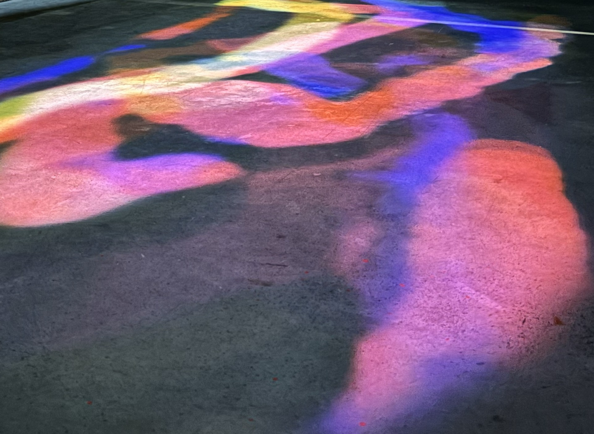

# Traces-collectives
Ce projet a été réalisé en 3 jours lors du workshop Erasme sur le thème de la mémoire par Letchoumy THIAGARADJA et Thaï LAI

## Les prérequis
1. Un ordinateur avec au moins une carte graphique
2. Un vidéo projecteur (préférablement courte focale)
3. AugmentaFusion
4. [TouchDesigner](https://derivative.ca/download)

## AugmentaFusion
Documentation pour mieux comprendre augmenta fusion : 

1. [Les exemples](https://github.com/Augmenta-tech/LABLAB-TouchDesigner-Template)
2. 

## Description 
### Le but ?
Ce projet parle de la mémoire collective et de son lien avec la mémoire individuelle. Le but est que l’utilisateur puisse laisser une trainée derrière lui.Chaque trace individuelle va se superposer aux autres et ainsi constituer une mémoire collective.

### La mémoire collective pour nous ?

La mémoire collective est une notion abstraite qui existe déjà et à laquelle chacun contribue. Elle participe également à la construction de la mémoire individuelle. Ainsi, même si l’on ne connaît pas certaines personnes, elles peuvent néanmoins faire partie de notre mémoire individuelle à travers les médias, les récits ou d’autres formes de transmission relevant de la mémoire collective.

Au cours de cette balade au sein du dispositif, nous explorons de manière intime l’espace qui nous accueille, la mémoire collective déjà présente en ces lieux,et nous y laissons à notre tour une trace individuelle qui par la suite participe à la mémoire collective.

### principe du dispositif